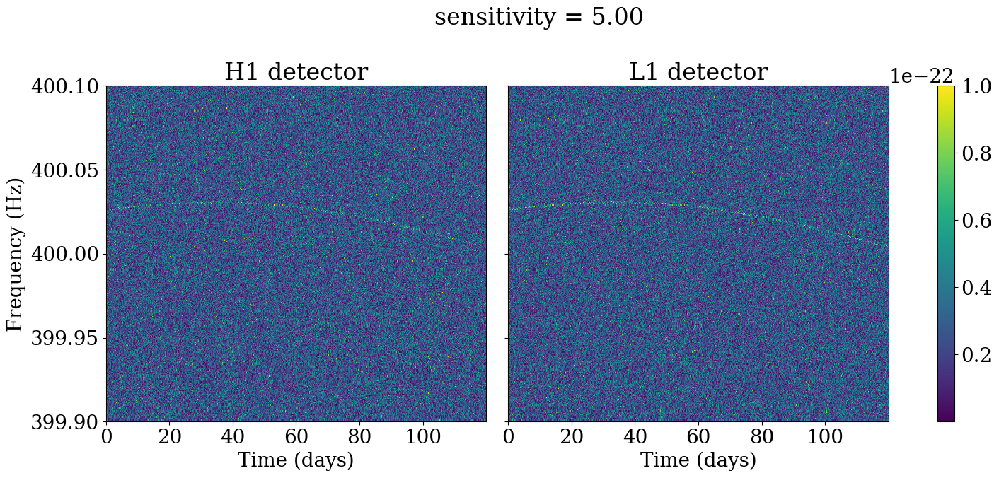
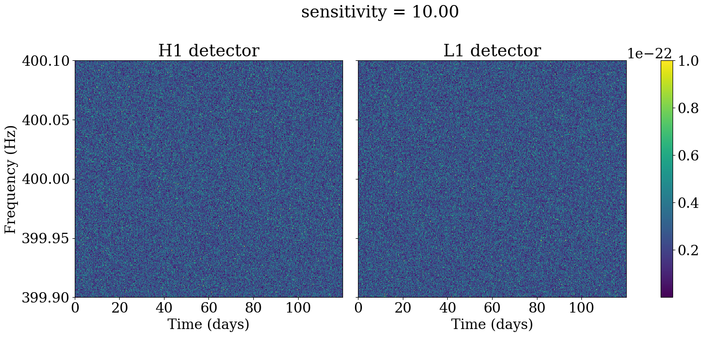

# Detección de ondas gravitacionales

Este repositorio implementa modelos de aprendizaje profundo para la detección de ondas gravitacionales continuas de larga duración (CW, por sus siglas en inglés).

Los datos se generan utilizando PyFstat, que puede simular señales CW detectadas por 2 interferómetros de LIGO, en Hanford ("H1") y Livingston ("L1").

La detección de ondas gravitacionales continuas es una tarea desafiante, ya que la amplitud de la señal suele ser órdenes de magnitud menor que la amplitud del ruido del detector.

A continuación, se presentan algunos ejemplos de señales CW ruidosas con diferentes profundidades de sensibilidad, donde la profundidad de sensibilidad se define como la relación entre las amplitudes del ruido y la señal. La señal CW es visible para una sensibilidad de 5, pero las características visuales tienden a desaparecer para una sensibilidad de 20 o menor.






---

# Requisitos

Además de las bibliotecas estándar (numpy, matplotlib, etc.), se requieren las siguientes:

- `PyFstat`
- `Pytorch`
- `timm`

# Generación de datos

Para generar un conjunto de datos con una sensibilidad específica y un número determinado de archivos, ejecuta:

```
python generate_data.py --sensitivity 10.0 --num_signals 1000
```

Esto generará un conjunto de datos que contiene tanto señales con solo ruido como señales CW ruidosas con parámetros aleatorizados. Las etiquetas (1 si los datos contienen una CW, de lo contrario 0) también se almacenan en un archivo CSV.

Consulta el cuaderno [tutorial notebook](https://github.com/PyFstat/PyFstat/blob/master/examples/tutorials/0_generating_noise.ipynb) para más detalles sobre la generación de datos y los parámetros de las señales o simplemente puedes ejecutar:

```
./generate_all_data.sh
```
para generar 4 conjuntos de datos con sensibilidades de 5.0, 10.0, 15.0 y 20.0, con 1000 muestras cada uno.

# Entrenamiento y evaluación del modelo

Proporcionamos 3 modelos basados en redes neuronales convolucionales (CNN) en utils.models. Una CNN simple personalizada con 3 capas convolucionales y 2 capas totalmente conectadas (FC) para el clasificador, una CNN más profunda con 4 capas convolucionales y 3 capas FC, y una CNN aún más profunda que utiliza EfficientNet_b0 como backbone.

#### Preprocesamiento/aumento de datos

Los datos provenientes de ambos sensores se recortan y concatenan para tener una forma de 2x360x4272. Para cada muestra, calculamos la potencia del espectrograma complejo y la normalizamos a media cero y varianza unitaria. Para mejorar la eficiencia computacional, promediamos sobre 48 marcos de tiempo consecutivos, de modo que la imagen de entrada a cada modelo tiene un tamaño de 2x360x89. Dado que cada marco de tiempo corresponde a 30 minutos de adquisición, el promedio sobre 48 marcos equivale al promedio de un día de 24 horas, lo que también debería atenuar las modulaciones de amplitud de corta escala debido a la rotación de la Tierra. Cabe destacar que este promedio se implementa como una capa convolucional (con pesos fijos) para aprovechar la GPU.

Como aumento de datos opcional, también traducimos aleatoriamente la señal a lo largo de las frecuencias y establecemos marcos de tiempo a cero para simular momentos en los que un detector estuvo fuera de servicio.

Para entrenar un modelo con los datos generados, ejecuta:

```
python train_model.py --model_name CNN --data_folder data/ --device mps --num_epochs 15 --batch_size 32
``` 
El mejor modelo (en términos de Área Bajo la Curva en el conjunto de validación) se guarda en `saved_models/`.